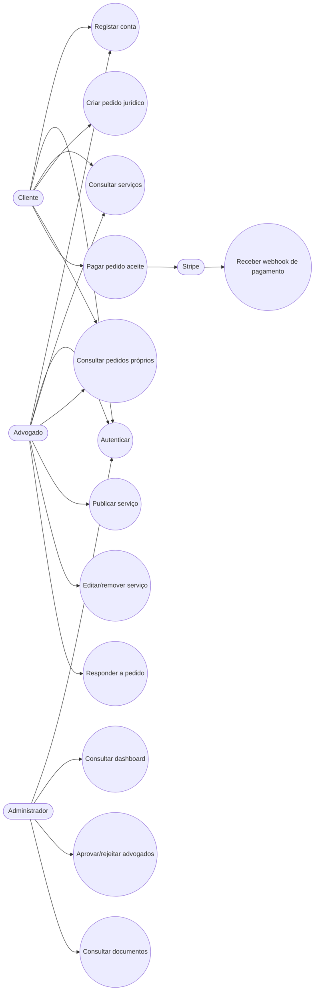
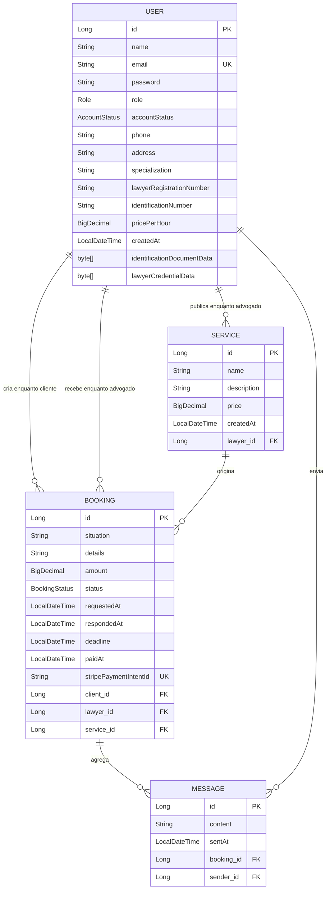
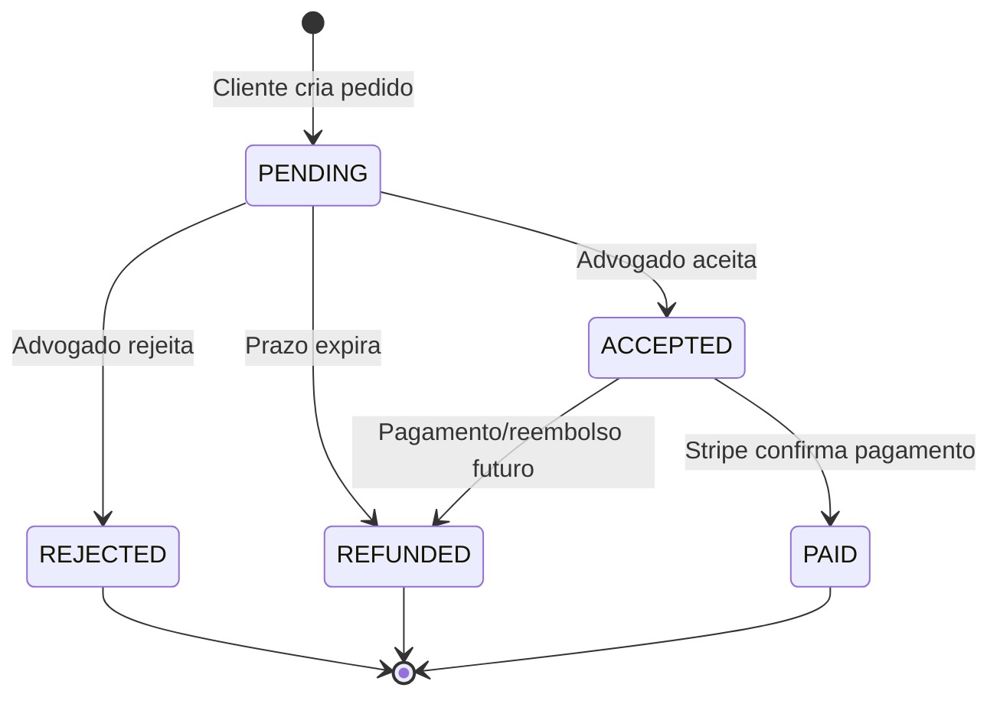
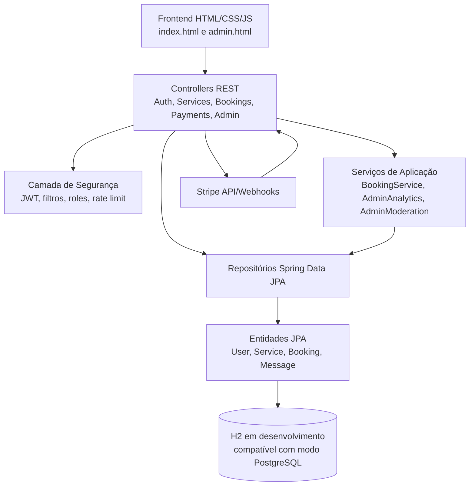
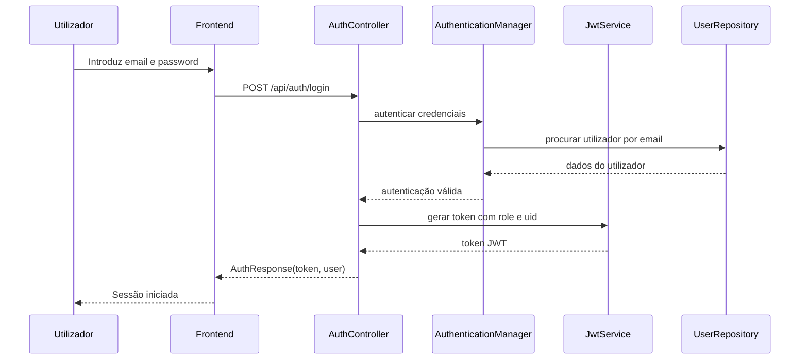
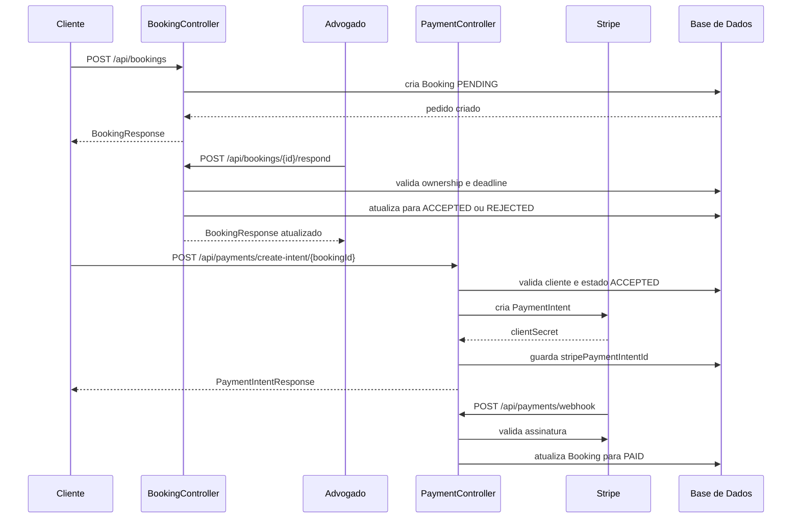
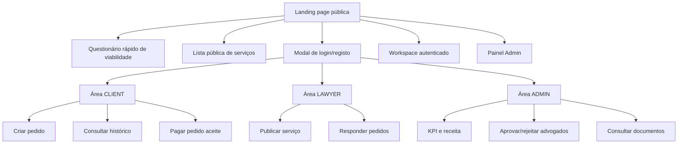
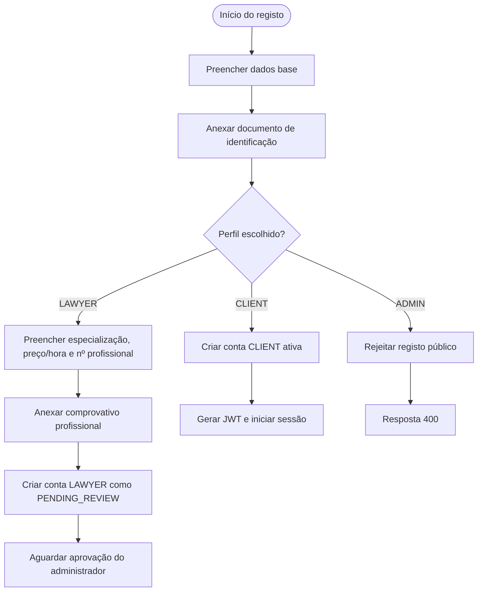
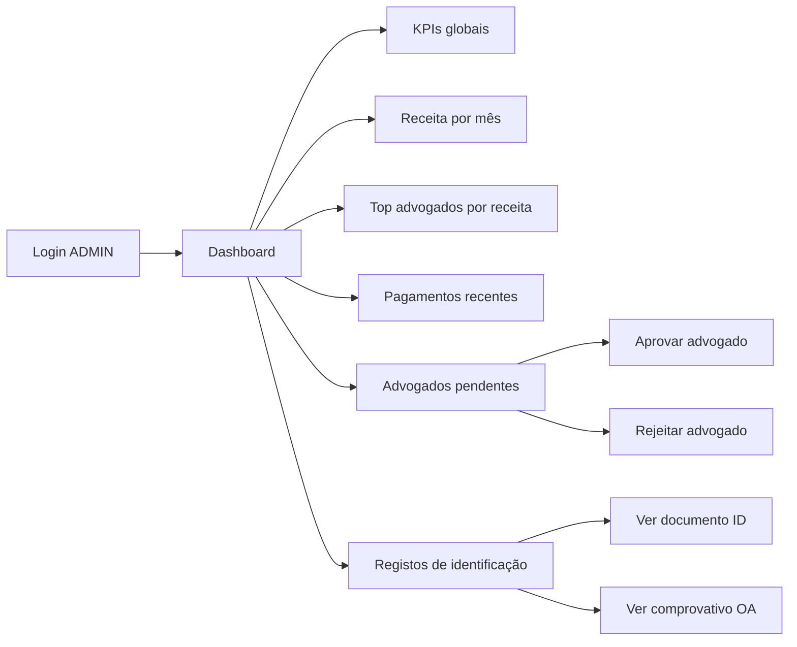

# Relatório de Projeto: LusoLaw — Marketplace Seguro de Serviços Jurídicos

## 1. Introdução

Este relatório descreve o desenvolvimento do **LusoLaw**, uma aplicação web desenvolvida em **Java 17** com **Spring Boot 3**, orientada para a criação de um marketplace de serviços jurídicos na área da imigração. O sistema permite que clientes encontrem advogados especializados, submetam pedidos de acompanhamento jurídico, recebam resposta dos profissionais e, após aceitação, avancem para pagamento através de integração com a **Stripe**.

O projeto demonstra uma aplicação prática de conceitos fundamentais de desenvolvimento backend moderno: arquitetura em camadas, persistência com JPA, autenticação e autorização com JWT, validação de dados, gestão de perfis, controlo de acesso, integração com serviços externos, tratamento centralizado de erros e testes de integração.

Para além da vertente funcional, o LusoLaw possui uma forte preocupação com **segurança**, **confidencialidade** e **moderação administrativa**, aspetos particularmente relevantes num domínio sensível como o jurídico, onde são tratados dados pessoais, documentos de identificação e comprovativos profissionais.

## 2. Análise de Contexto

O contexto funcional do projeto é o de uma plataforma digital que aproxima **clientes imigrantes** ou pessoas com necessidades jurídicas relacionadas com imigração de **advogados verificados**. Ao contrário de uma simples listagem pública de profissionais, o sistema inclui mecanismos de confiança: registo documental obrigatório, validação de advogados por administrador, permissões por perfil e pagamentos controlados.

A aplicação pode ser vista como uma solução educativa e técnica para demonstrar como uma aplicação realista em Spring Boot organiza responsabilidades. O backend expõe uma API REST, serve páginas HTML estáticas e gere três grandes áreas de utilização:

* **Cliente**: regista-se, consulta serviços, cria pedidos jurídicos e paga pedidos aceites.
* **Advogado**: regista-se com comprovativo profissional, aguarda aprovação, publica serviços e responde a pedidos.
* **Administrador**: valida advogados, consulta documentos, acompanha KPIs, receita e atividade da plataforma.

Esta separação por perfis permite demonstrar de forma clara a importância da autorização baseada em papéis (*role-based access control*), bem como a necessidade de proteger operações críticas em aplicações web.

## 3. Requisitos

### Requisitos Funcionais

* O sistema deve permitir o registo de utilizadores com diferentes perfis: `CLIENT`, `LAWYER` e `ADMIN`.
* O sistema deve impedir que contas `ADMIN` sejam criadas através do registo público.
* O sistema deve exigir documento de identificação no registo de clientes e advogados.
* O sistema deve exigir comprovativo profissional adicional no registo de advogados.
* O sistema deve criar contas de advogado em estado `PENDING_REVIEW`, aguardando aprovação administrativa.
* O sistema deve permitir autenticação com email e password, devolvendo um token JWT.
* O sistema deve permitir que advogados ativos criem, editem e removam serviços jurídicos.
* O sistema deve permitir que qualquer utilizador consulte a lista pública de serviços.
* O sistema deve permitir que clientes autenticados submetam pedidos de serviço jurídico.
* O sistema deve permitir que advogados respondam apenas aos pedidos que lhes pertencem.
* O sistema deve gerir estados de pedido: `PENDING`, `ACCEPTED`, `REJECTED`, `REFUNDED` e `PAID`.
* O sistema deve marcar pedidos pendentes expirados como `REFUNDED` quando ultrapassam o prazo definido.
* O sistema deve permitir a criação de intenções de pagamento Stripe para pedidos aceites.
* O sistema deve processar webhooks Stripe assinados para confirmar pagamentos bem-sucedidos.
* O sistema deve disponibilizar um painel administrativo com KPIs, receita, pagamentos recentes e ranking de advogados.
* O sistema deve permitir ao administrador aprovar ou rejeitar contas de advogado pendentes.
* O sistema deve permitir ao administrador consultar documentos de identificação e comprovativos profissionais.

### Requisitos Não-Funcionais

* O projeto deve usar **Java 17** e **Spring Boot**.
* A aplicação deve seguir uma arquitetura em camadas, separando controladores, serviços, repositórios, modelos, DTOs e segurança.
* A autenticação deve ser **stateless**, baseada em JWT.
* As passwords devem ser armazenadas com hashing seguro, usando `BCryptPasswordEncoder`.
* As respostas de erro devem ser padronizadas em JSON.
* A aplicação deve validar os dados recebidos através de Bean Validation e validações adicionais nos controladores.
* O acesso aos endpoints deve respeitar permissões por perfil.
* A aplicação deve incluir proteção contra abuso através de *rate limiting* em login e registo.
* Os documentos carregados devem ser limitados em tamanho e tipo MIME.
* A integração Stripe deve exigir configuração explícita por variáveis de ambiente.
* A aplicação deve possuir testes de integração para cenários críticos de segurança e administração.
* O projeto deve ser facilmente executável localmente com Maven.

## 4. Diagramas de Casos de Uso

O diagrama seguinte apresenta os principais atores do sistema e as funcionalidades que cada um pode executar.

O sistema distingue claramente operações públicas, operações autenticadas e operações reservadas a perfis específicos. Por exemplo, qualquer utilizador pode consultar serviços, mas apenas um advogado autenticado e aprovado pode criar serviços. Da mesma forma, só o cliente dono de um pedido pode iniciar o pagamento correspondente.

## 5. User Stories

1. **Como** cliente, **quero** criar uma conta com os meus dados e documento de identificação **para** poder pedir apoio jurídico de forma segura.
2. **Como** cliente, **quero** consultar serviços jurídicos disponíveis **para** escolher o advogado mais adequado à minha situação.
3. **Como** cliente, **quero** submeter um pedido com a minha situação e detalhes **para** receber resposta de um advogado.
4. **Como** cliente, **quero** pagar apenas depois de o advogado aceitar o pedido **para** evitar pagamentos indevidos.
5. **Como** advogado, **quero** registar-me com comprovativo profissional **para** demonstrar que sou um profissional legítimo.
6. **Como** advogado, **quero** publicar serviços jurídicos com descrição e preço **para** apresentar a minha oferta aos clientes.
7. **Como** advogado, **quero** aceitar ou rejeitar pedidos recebidos **para** gerir a minha disponibilidade profissional.
8. **Como** administrador, **quero** aprovar manualmente contas de advogado **para** proteger a credibilidade da plataforma.
9. **Como** administrador, **quero** consultar KPIs e pagamentos recentes **para** acompanhar a saúde operacional do marketplace.
10. **Como** administrador, **quero** consultar documentos submetidos **para** validar identidade e conformidade dos utilizadores.
11. **Como** sistema, **quero** validar tokens JWT em cada pedido privado **para** garantir que apenas utilizadores autorizados acedem a recursos protegidos.
12. **Como** sistema, **quero** processar webhooks Stripe assinados **para** atualizar pagamentos com segurança.

## 6. Análise de Domínio / Modelo Entidade-Relação

O domínio principal do LusoLaw assenta em três entidades centrais: `User`, `Service` e `Booking`. A entidade `Message` está preparada para representar comunicação associada a pedidos, embora o fluxo principal do projeto esteja centrado em serviços, reservas/pedidos e pagamentos.

### Estados principais de um pedido

Este modelo permite separar o ciclo de vida do pedido em etapas compreensíveis. O pedido nasce como `PENDING`, só pode ser pago depois de `ACCEPTED` e passa para `PAID` apenas quando a confirmação chega através da Stripe.

## 7. Análise da Estrutura do Projeto

O projeto está organizado segundo uma arquitetura típica de aplicação Spring Boot, com responsabilidades bem distribuídas por pacotes.

### Pacotes principais

* `controller`: expõe os endpoints REST e faz a ponte entre HTTP e lógica da aplicação.
* `model`: contém as entidades persistidas com JPA.
* `dto`: define objetos de entrada e saída, evitando expor diretamente as entidades completas.
* `repository`: usa Spring Data JPA para acesso à base de dados.
* `service`: concentra regras de negócio mais específicas, como analytics, moderação e expiração de pedidos.
* `security`: implementa autenticação JWT, controlo de utilizador atual, rate limiting e respostas JSON para erros de autenticação/autorização.
* `config`: configura Spring Security, permissões por endpoint, headers de segurança e codificação de passwords.
* `loader`: permite criar dados de demonstração e uma conta administrativa inicial.
* `exception`: centraliza o tratamento de exceções e uniformiza respostas de erro.

### Fluxo de autenticação

### Fluxo de pedido e pagamento

### Aplicação dos princípios de Programação Orientada a Objetos

* **Encapsulamento**: as entidades `User`, `Service`, `Booking` e `Message` mantêm o seu estado interno através de atributos privados e métodos de acesso. A camada exterior não manipula diretamente a persistência, recorrendo a repositórios e serviços.
* **Abstração**: os DTOs escondem detalhes internos das entidades e apresentam apenas os dados necessários à API. Os repositórios abstraem o acesso à base de dados.
* **Polimorfismo**: o Spring injeta implementações concretas através de interfaces como `UserDetailsService`, `AuthenticationEntryPoint` e `AccessDeniedHandler`. O código depende de contratos, não de implementações rígidas.
* **Separação de responsabilidades**: controladores lidam com HTTP, serviços lidam com regras de negócio, repositórios lidam com dados e a camada de segurança concentra autenticação/autorização.

## 8. Apresentação do Projeto Final: Figuras Mermaid da Interface e dos Módulos

Como este relatório usa Mermaid para substituir imagens estáticas, as figuras seguintes representam a navegação e a experiência funcional da aplicação.

### 8.1. Navegação geral da aplicação

### 8.2. Registo de utilizador

### 8.3. Painel administrativo

## 9. Qualidade Técnica, Segurança e Testes

O LusoLaw apresenta várias decisões técnicas relevantes para um projeto académico ou profissional de backend:

* **JWT obrigatório para operações privadas**: endpoints sensíveis exigem autenticação e o token inclui informação sobre perfil e identificador do utilizador.
* **Autorização por perfil**: a configuração de segurança restringe endpoints de serviços, bookings, pagamentos e administração.
* **Proteção contra criação pública de administradores**: o registo público rejeita explicitamente o perfil `ADMIN`.
* **Aprovação manual de advogados**: contas `LAWYER` não ficam imediatamente ativas, reduzindo risco de perfis falsos.
* **Upload documental controlado**: são aceites apenas PDF e imagens comuns, com limite de tamanho.
* **Respostas de erro consistentes**: `GlobalExceptionHandler`, `RestAuthenticationEntryPoint` e `RestAccessDeniedHandler` produzem JSON previsível para erros.
* **Rate limiting simples**: tentativas de login e registo são limitadas em memória para reduzir abuso.
* **Stripe com idempotência**: a criação de pagamentos usa chave de idempotência baseada no booking.
* **Webhook assinado**: o endpoint de webhook exige validação da assinatura Stripe antes de atualizar pagamentos.
* **Headers de segurança**: a configuração inclui CSP, HSTS, `frame-ancestors 'none'`, `Permissions-Policy` e proteção contra *clickjacking*.
* **Testes de integração**: existem testes para impedir criação de serviços por utilizadores não autenticados, impedir clientes de criarem serviços, garantir que passwords não são devolvidas, impedir advogados de responderem a pedidos de outros advogados, bloquear criação pública de admins, impedir login de advogado pendente e proteger o dashboard administrativo.

> Nota técnica: neste ambiente de análise não foi possível executar `mvn test`, porque o Maven não se encontra instalado. Ainda assim, a estrutura de testes está presente no projeto e cobre cenários essenciais de segurança.

## 10. Conclusão Geral / Reflexão Final

O projeto **LusoLaw** demonstra uma aplicação web sólida e realista, com uma arquitetura adequada para um marketplace de serviços jurídicos. A separação entre clientes, advogados e administradores está bem refletida tanto no modelo de dados como na camada de segurança. O uso de JWT, BCrypt, DTOs, validação de dados, tratamento centralizado de erros e permissões por perfil revela uma preocupação consistente com boas práticas de engenharia de software.

Do ponto de vista pedagógico, o projeto é particularmente interessante porque permite observar como os conceitos de Programação Orientada a Objetos e arquitetura em camadas deixam de ser ideias abstratas e passam a resolver problemas concretos: quem pode fazer o quê, como se protege informação sensível, como se modela um ciclo de vida de negócio e como se integra um serviço externo de pagamentos.

A aplicação tem ainda espaço natural para evolução futura: sistema de mensagens completo entre cliente e advogado, notificações por email, armazenamento externo de documentos, base de dados PostgreSQL em produção, integração real com frontend moderno, auditoria de ações administrativas, políticas de retenção documental e mecanismos avançados de conformidade com proteção de dados. Mesmo assim, na sua forma atual, o LusoLaw já constitui uma base muito consistente para demonstrar desenvolvimento backend moderno com Java e Spring Boot.
